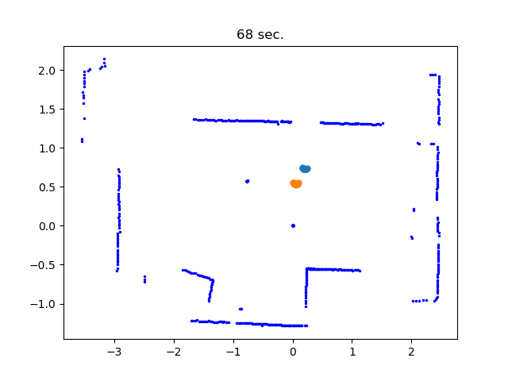

# Leg-dataset-CXX-Version



Name: Leg dataset C++ version

Brief:\
This C++ version is modified from the RSL Leg dataset matlab version.\
This code displays the collected laser data from Minibot.\
The data rate is 1HZ. The metric is meter.\
If the XY of data is 0, it represents out of laser range.

Data format:\
xy_data ( std::vector collect 120 Eigen::MatrixXd (720 X 2) ) : 720 scans, xy data, 120 seconds.
 
**Revision: 1.0.cpp**\
Authors: Yu-Jyun Ou (neko7055@gmail.com) (Discord: Nuko#1247)\
Date: 2023-03-27

# Scitation
This project uses the following two open source projects. 
1. [Eigen3](https://eigen.tuxfamily.org/index.php?title=Main_Page)
2. [Matplotlib-cpp](https://matplotlib-cpp.readthedocs.io/en/latest/)

# Dependent
+ cmake
+ python3-dev
+ matplotlib
+ numpy

# Compile & Usage
```bash=
git clone https://github.com/NcuMathRoboticsLab/Leg-dataset-CXX-Version.git
cd Leg-dataset-CXX-Version
mkdir build
cd build
cmake ..
cmake --build .
./main
```
